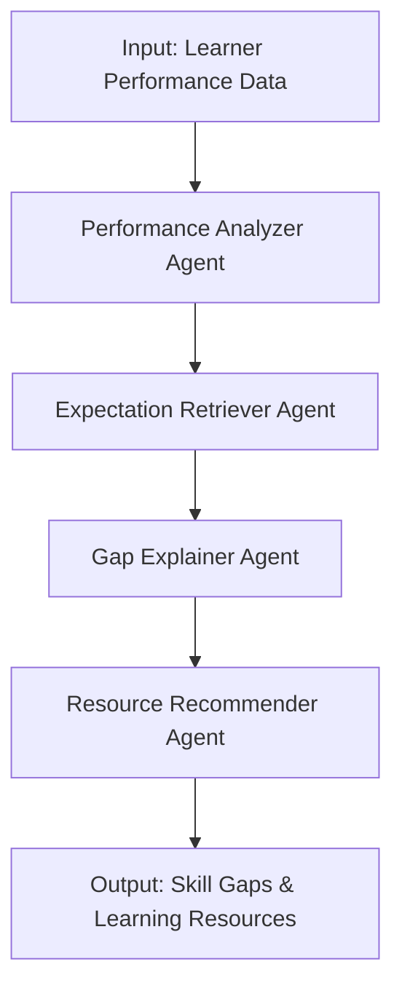

# 🤖 Agentic AI Skill Gap Analyzer

A multi-agent AI system designed to help learners understand and address their skill gaps by analyzing their performance, comparing it with industry expectations, explaining the gaps, and recommending learning resources.

---

## 🌐 Overview

The Agentic AI Skill Gap Analyzer leverages LangChain, LangGraph, Google Gemini, and FAISS to simulate a reasoning workflow involving multiple agents. Each agent is responsible for a specific sub-task:

* **Performance Analyzer**: Identifies weak areas from user data
* **Expectation Retriever**: Fetches role-specific skill benchmarks
* **Gap Explainer**: Explains the difference between learner skills and industry expectations
* **Resource Recommender**: Suggests resources to bridge the identified skill gaps

All components interact within a Streamlit web interface.

---

## 📂 Project Structure

```
agentic_ai/
├── .env
├── requirements.txt
├── src/
│   └── main.py                     # Streamlit app entry point
├── data/
│   └── industry_benchmarks/
│       └── sample_roles.jsonl     # Benchmark data
│   ├── agents/
│   │   ├── performance_analyzer.py
│   │   ├── expectation_retriever.py
│   │   ├── gap_explainer.py
│   │   └── resource_recommender.py
│   ├── rag/
│   │   ├── rag_index.py
│   │   └── rag_utils.py
│   └── utils/
│       └── common.py
└── logs/                           # Log storage (optional)
```

---

## 🤖 Workflow Diagram



---

## ⚖️ Technologies Used

* **LangChain**: Orchestrates LLM interactions
* **LangGraph**: Enables multi-agent state transitions
* **Gemini (Google Generative AI)**: Handles prompt-based reasoning and explanation
* **FAISS**: Stores and retrieves role benchmark data
* **Streamlit**: UI framework
* **PyMuPDF**: Parses role expectation PDFs

---

## 📆 Setup Instructions

### 1. Clone and Setup

```bash
git clone https://github.com/your-username/agentic_ai.git
cd agentic_ai
python -m venv venv
source venv/bin/activate  # or venv\Scripts\activate for Windows
pip install -r requirements.txt
```

### 2. Create `.env`

```env
GOOGLE_API_KEY=your_google_gemini_api_key_here
```

### 3. Add Role Expectations PDF

Place the file here:

```
data/industry_benchmarks/industry_roles_dataset.pdf
```

### 4. Run the Application

```bash
streamlit run src/main.py
```

---

## 🔍 Example Input

```json
{
  "scores": [
    {"topic": "DSA", "score": 45},
    {"topic": "Array", "score": 40},
    {"topic": "Machine Learning", "score": 30}
  ]
}
```

---

## 🚀 Features

* Interactive Streamlit UI
* FAISS-powered RAG search on benchmark expectations
* Structured gap explanations via Gemini
* Recommended tutorials, videos, or problems

---

## 📊 Output Includes

* **Weak Areas**: Identified from input data
* **Role Expectations**: Retrieved using RAG
* **Gap Analysis**: Comparison of learner vs. expected
* **Learning Resources**: Suggested based on gap

---

## 👩‍💼 Author

Developed by **Vigneshwaran A (SNSIHUB)**

---

## 📄 License

MIT License. Free to use, distribute, and modify.
