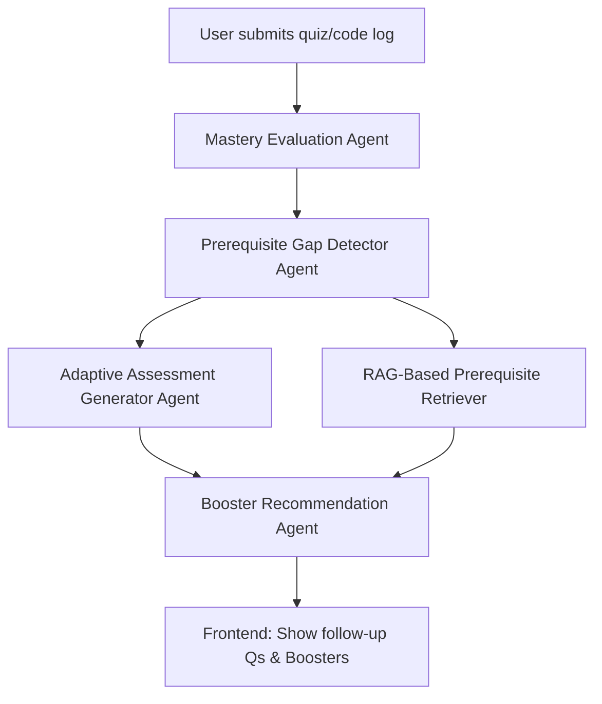

Here’s a **complete and updated `README.md`** for your **Agentic AI-Based Concept Mastery Evaluator and Prerequisite Recommender**, based on your latest architecture adjustments:

---

# 🧠 Agentic AI-Based Concept Mastery Evaluator and Prerequisite Recommender

> A modular, agentic AI system powered by **LangGraph**, **FastAPI**, and **Gemini 1.5**, designed to assess learner understanding, detect gaps, generate adaptive assessments, and recommend personalized boosters or explanations.

---

## 🔧 System Overview

```
                 ┌───────────────────────────────────────────────┐
                 │              🌐 Frontend Interface             │
                 │  (Quiz UI, Code Editor, Dashboard, Map View)  │
                 └──────────────┬────────────────────────────────┘
                                │
                                ▼
             ┌───────────────────────────────────────────────┐
             │              🚀 FastAPI Backend (API Layer)    │
             │    - Exposes endpoints for each Agent          │
             │    - Orchestrates LangGraph agent flow         │
             └──────────────┬────────────────────────────────┘
                            │
                            ▼
     ┌──────────────────────────────────────────────────────────────────────┐
     │                   🧠 Agentic AI System (LangGraph)                   │
     │ ┌──────────────────────────────────────────────────────────────────┐ │
     │ │ Head Agent: Mastery Evaluation Agent                             │ │
     │ │ - Input: quiz/code/times/logs                                    │ │
     │ │ - Output: concept mastery map                                    │ │
     │ └──────────────────────────────────────────────────────────────────┘ │
     │            ┌────────────────────┬────────────────────┐             │
     │            ▼                    ▼                    ▼             │
     │  ┌─────────────────┐  ┌────────────────────────┐  ┌────────────────┐│
     │  │ Agent 2         │  │ Agent 3                │  │ Agent 5        ││
     │  │ Prerequisite    │  │ Adaptive Assessment    │  │ RAG Retriever  ││
     │  │ Gap Detector    │  │ Generator              │  │ Agent          ││
     │  └─────────────────┘  └────────────────────────┘  └────────────────┘│
     │            │                        ▲                    ▲          │
     │            ▼                        └────── Interlinked ────────────┘
     │  ┌────────────────────────────────────────────────────────────────┐ │
     │  │ Agent 4: Booster Recommendation Agent                          │ │
     │  └────────────────────────────────────────────────────────────────┘ │
     └──────────────────────────────────────────────────────────────────────┘
                            │
                            ▼
              ┌────────────────────────────────────────┐
              │     🗂️ Database / Vectorstore Layer     │
              │ - Learner history, logs, preferences    │
              │ - Concept mastery records               │
              │ - FAISS vectorstore of curriculum       │
              └────────────────────────────────────────┘
```

---

## 🛠 Tech Stack

| Layer           | Technology                                  |
| --------------- | ------------------------------------------- |
| Frontend        | React (or Flutter, Next.js)                 |
| Backend         | **FastAPI** (Python)                        |
| Orchestration   | **LangGraph**                               |
| LLM             | **Gemini 1.5** via `langchain_google_genai` |
| Vector DB       | FAISS + `GoogleGenerativeAIEmbeddings`      |
| Content Source  | Internal `curriculum.jsonl` or MongoDB      |
| Auth (optional) | Firebase / OAuth2                           |
| Dev Tools       | Postman, Uvicorn, dotenv                    |

---

## 🧠 Agent Modules

Each agent lives in a separate folder inside `/agents`.

```bash
agents/
├── adaptive_assessor/         # Agent 3
├── booster_recommender/       # Agent 4
├── mastery_evaluator/         # Head Agent
├── prerequisite_detector/     # Agent 2
└── prerequisite_retriever/    # Agent 5
```

Each includes:

* `agent.py` – defines agent logic
* `prompts.py` – structured Gemini prompt templates
* `vectorstore.py` – (only in `retriever`) for FAISS/embedding handling

---

## 🌐 API Endpoints

| Endpoint                                   | Description                             |
| ------------------------------------------ | --------------------------------------- |
| `POST /api/evaluate/mastery`               | Run **Mastery Evaluation Agent**        |
| `POST /api/evaluate/prerequisite-gaps`     | Run **Prerequisite Gap Detector Agent** |
| `POST /api/evaluate/adaptive-assess`       | Run **Adaptive Assessment Generator**   |
| `POST /api/evaluate/booster-recommend`     | Run **Booster Recommender Agent**       |
| `POST /api/evaluate/retrieve-prerequisite` | Run **RAG Retriever Agent**             |
| `POST /api/evaluate/full-flow`             | Run **orchestrated flow** via LangGraph |

---

## 🔁 LangGraph Agent Flow



---

## 🧬 Environment Setup

1. **Clone the repo:**

```bash
git clone https://github.com/your-username/agentic-concept-evaluator.git
cd agentic-concept-evaluator
```

2. **Install Python dependencies:**

```bash
python -m venv venv
source venv/bin/activate  # on Windows: venv\Scripts\activate
pip install -r requirements.txt
```

3. **Set environment variables:**

Create a `.env` file with the following:

```env
GEMINI_API_KEY=your_google_api_key
GEMINI_MODEL=models/gemini-1.5-pro
```

4. **Run FastAPI server:**

```bash
uvicorn main:app --reload --port 5000
```

---

## 💾 Data Requirements

* Your curriculum data must be in `.jsonl` format.
* Each entry should follow:

```json
{
  "id": "concept_123",
  "concept": "Recursion in Python",
  "description": "...",
  "examples": [...],
  "tags": ["python", "recursion"]
}
```

* This file is loaded into FAISS via `vectorstore.py`.

---

## 📍 Next Steps

| Goal                         | Recommendation                                        |
| ---------------------------- | ----------------------------------------------------- |
| 🧠 Build full LangGraph flow | Implement `evaluate/full-flow` in `main.py`           |
| 🎯 Store learner progress    | Integrate MongoDB/Postgres in `db/` layer             |
| 🧩 Add frontend learning map | Build a React UI that consumes mastery/recommendation |
| 🧪 Add test logging          | Record quiz/code inputs for further training          |

---

## ✅ Project Highlights

* ✅ **Modular**: Each agent can be tested independently.
* ✅ **Agentic**: No hardcoded logic, full LLM-driven.
* ✅ **Expandable**: Easily add more agents (e.g., career recommender).
* ✅ **LangGraph-powered**: Supports conditional flows and agent linking.
* ✅ **Learner-Centric**: Adaptive and personalized feedback.

---

## 📬 Contact / Contributions

> 💬 Questions? Issues? Want to contribute?
> Open an issue or email: `youremail@example.com`

---

Would you like me to:

* Scaffold a sample `/main.py` with the full agent flow?
* Set up the frontend starter in React for this?

Let me know and I’ll prepare it.
