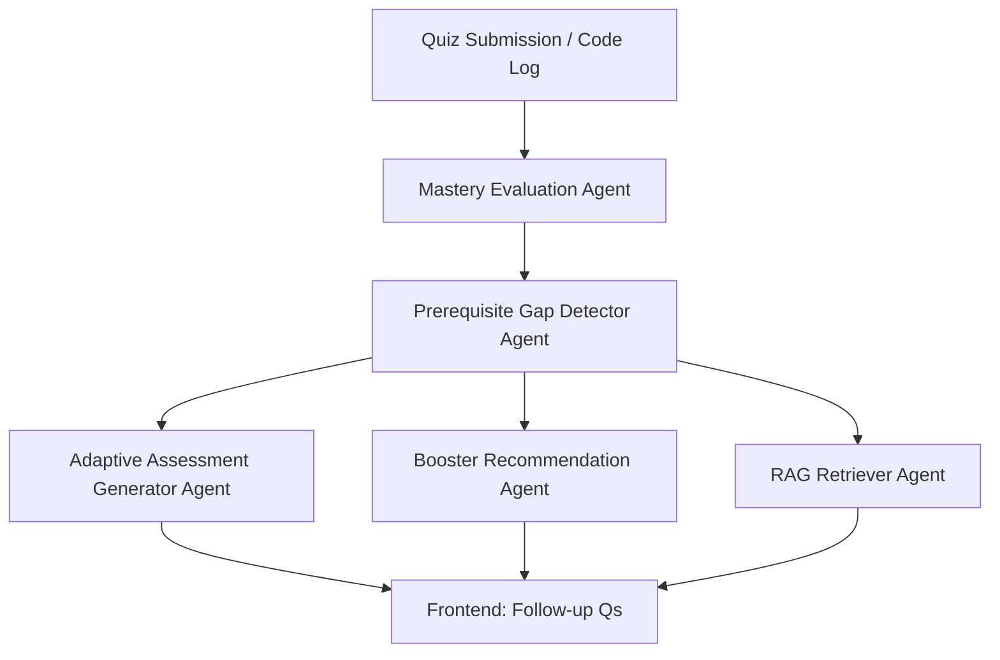

Here is your **complete Agentic AI System Architecture** for the:

> 🧠 **Agentic AI-Based Concept Mastery Evaluator and Prerequisite Recommender**

---

## 🏗️ Architecture Overview

```                 ┌───────────────────────────────────────────────┐
                 │              🌐 Frontend Interface             │
                 │  (Quiz UI, Code Editor, Dashboard, Map View)  │
                 └──────────────┬────────────────────────────────┘
                                │
                                ▼
             ┌───────────────────────────────────────────────┐
             │              🚀 FastAPI Backend (API Layer)    │
             │    - Exposes endpoints for each Agent          │
             │    - Orchestrates LangGraph agent flow         │
             └──────────────┬────────────────────────────────┘
                            │
                            ▼
     ┌────────────────────────────────────────────────────────────────────┐
     │                    🧠 Agentic AI System (LangGraph)                │
     │   ┌────────────────────────────────────────────────────────────┐   │
     │   │  🔰 Agent 1: Mastery Evaluation Agent (HEAD)               │   │
     │   │  - Input: quiz/code/times/logs                            │   │
     │   │  - Output: concept mastery map                            │   │
     │   │  - Triggers: Agents 2, 3, 4                                │   │
     │   └──────┬─────────────────────────────────────────────────────┘   │
     │          │                                                        │
     │ ┌────────▼──────────────────────────────────────────────────────┐ │
     │ │  🧩 Agent 2: Prerequisite Gap Detector Agent                 │ │
     │ │  - Input: weak concepts from Agent 1                        │ │
     │ │  - Output: inferred prerequisite gaps                       │ │
     │ └────────┬────────────────────────────────────────────────────┘ │
     │          │                                                      │
     │          │  🔁 Interconnected Feedback Loop                     │
     │          ▼                                                      │
     │ ┌──────────────────────────────────────────────────────────────┐ │
     │ │  🔍 Agent 5: RAG-Based Prerequisite Retriever Agent         │ │
     │ │  - Input: gaps from Agent 2                                │ │
     │ │  - Output: top-3 internal explanations, analogies          │ │
     │ └──────────────────────────────────────────────────────────────┘ │
     │                                                                  │
     │ ┌──────────────────────────────────────────────────────────────┐ │
     │ │  🎯 Agent 3: Adaptive Assessment Generator Agent             │ │
     │ │  - Input: weak concept + history                            │ │
     │ │  - Output: 3-level question set with reasoning prompts      │ │
     │ └──────────────────────────────────────────────────────────────┘ │
     │                                                                  │
     │ ┌──────────────────────────────────────────────────────────────┐ │
     │ │  📚 Agent 4: Booster Recommendation Agent                    │ │
     │ │  - Input: prerequisite gaps + preference profile            │ │
     │ │  - Output: tailored micro-lessons, quizzes                  │ │
     │ └──────────────────────────────────────────────────────────────┘ │
     └────────────────────────────────────────────────────────────────────┘
                            │
                            ▼
              ┌────────────────────────────────────────┐
              │     🗂️ Database / Vectorstore Layer     │
              │ - Learner history, logs, preferences    │
              │ - Concept mastery records               │
              │ - FAISS vectorstore of curriculum       │
              └────────────────────────────────────────┘

```

---

## 🔩 Tech Stack Summary

| Layer           | Technology                                    |
| --------------- | --------------------------------------------- |
| Frontend        | React (or Flutter, Next.js)                   |
| API Layer       | FastAPI (Python)                              |
| AI Models       | **Gemini 1.5** (via `langchain_google_genai`) |
| Orchestration   | **LangGraph** agents                          |
| Vector DB       | FAISS + `GoogleGenerativeAIEmbeddings`        |
| Content Source  | Internal `curriculum.jsonl` or DB             |
| Auth (optional) | Firebase / OAuth2                             |
| Dev Tools       | Postman, Uvicorn, dotenv                      |

---

## 🧬 API Endpoints You Now Have

| Endpoint                                   | Description                                 |
| ------------------------------------------ | ------------------------------------------- |
| `POST /api/evaluate/mastery`               | Run Agent 1 to assess concept strength      |
| `POST /api/evaluate/prerequisite-gaps`     | Run Agent 2 to detect gaps (pure agent)     |
| `POST /api/evaluate/adaptive-assess`       | Run Agent 3 to generate 3-level questions   |
| `POST /api/evaluate/booster-recommend`     | Run Agent 4 to suggest boosters             |
| `POST /api/evaluate/retrieve-prerequisite` | Run Agent 5 to retrieve RAG content         |
| *Next*: `POST /api/evaluate/full-flow`     | Orchestrate the full pipeline via LangGraph |

---

## 🔁 Suggested LangGraph Agent Flow



---

## 🧩 Modular Agent Code Locations

Each agent is implemented independently:

```
agents/
├── adaptive_assessor/
├── booster_recommender/
├── mastery_evaluator/
├── prerequisite_detector/
└── prerequisite_retriever/
```

Each contains:

* `agent.py`
* `prompts.py`
* (retriever also has `vectorstore.py`)

---

## ✅ Final Notes

* 🛡️ Everything is **pure agentic**, reasoning via Gemini using prompts, not rules
* ♻️ Agents can be tested and reused independently or orchestrated
* 📊 You can visualize learning via a React dashboard (next step)

---

Would you like to:

1. 🧠 Build the **LangGraph pipeline** (`/evaluate/full-flow`) to connect all 5 agents?
2. 💡 Design the **interactive frontend knowledge map** for learners?
3. 💾 Add **MongoDB**/Postgres to persist mastery data?

Let me know — I’ll guide you next step based on your goal.
